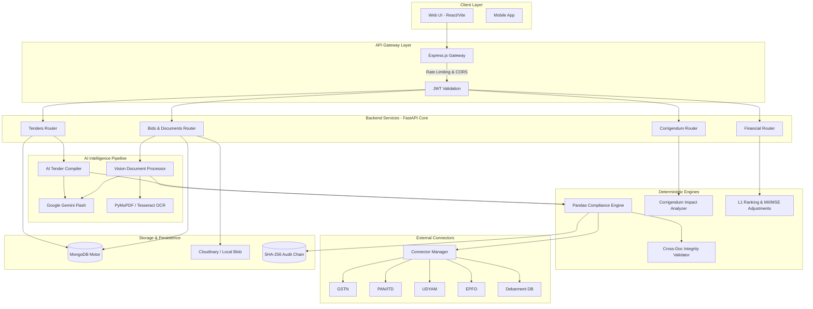

<div align="center">
  
  <h1>RashtraBid (GeM-Guard) 🇮🇳</h1>
  <p><strong>AI-Powered Integrated Bid Compliance Verification Platform for GeM Procurement</strong></p>
  <p><i>Smart India Hackathon 2026 | Problem Statement: 26100 | Ministry of Petroleum & Natural Gas (CPCL)</i></p>

  <p>
    <a href="#overview">Overview</a> • 
    <a href="#architecture">Architecture</a> • 
    <a href="#key-modules--ai-pipeline">Key Modules</a> • 
    <a href="#financial--corrigendum-engines">Advanced Engines</a> • 
    <a href="#technology-stack">Tech Stack</a> • 
    <a href="#security--audit">Security</a> • 
    <a href="#getting-started">Getting Started</a>
  </p>
</div>

---

## 📑 Overview

Government procurement via the **Government e-Marketplace (GeM)** requires exhaustive verification of statutory, regulatory, and eligibility credentials. Currently, Procurement Officers manually cross-verify extensive bidder documentation (Udyam, GSTIN, PAN, MII Declarations, CA Certificates, EPFO/ESIC). This labor-intensive process leads to prolonged evaluation cycles (often weeks), subjective inconsistencies, and high susceptibility to human error.

**RashtraBid (GeM-Guard)** is a deterministic, AI-driven automation pipeline designed for Central Public Sector Enterprises (CPSEs). It autonomously ingests Tender RFPs to compile structured compliance rules, extracts entities from bidder documents using dual-engine Vision AI, cross-validates data using Pandas-driven integrity checks, and executes real-time queries against simulated external government registries. 

### 🎯 Expected Impact
- **80% Reduction in Verification Effort**: Complete elimination of manual document transcription.
- **Accelerated Tender Lifecycles**: Financial L1 ranking generated in minutes instead of weeks.
- **Cross-Document Integrity**: Automated detection of inter-document contradictions (e.g., PAN vs. Udyam legal name mismatches).
- **Tamper-Evident Accountability**: SHA-256 cryptographically chained audit logs for every system and manual action.
- **Graceful Degradation**: Zero auto-disqualifications due to registry timeouts.

---

## 🏗️ System Architecture

RashtraBid employs a highly modular, decoupled microservices architecture designed for scale, resilience, and strict Role-Based Access Control (RBAC).



---

## 🧠 Key Modules & AI Pipeline

### 1. AI Tender Compiler (`tender_compiler.py`)
Ingests raw PDF RFPs and deterministically compiles them into strict, machine-readable `RequirementRule` domain models.
- **Engine**: PyMuPDF structural layout parsing combined with Google Gemini Flash-Lite.
- **Fallback**: High-precision regex engine for offline/air-gapped extraction.
- **Extraction**: Financial turnover thresholds (INR Cr), Make in India (MII) local content percentages, and statutory requirements.

### 2. Vision Document Processor (`document_processor.py`)
Processes bidder-uploaded compliance documents to extract evidence.
- **Dual-Engine Extraction**: Utilizes `PyMuPDF` for digital PDFs (text blocks, coordinates) and falls back to `pytesseract` for scanned images.
- **Coordinate Normalization**: Generates highly precise bounding boxes `[x1, y1, x2, y2]` normalized to a 0-1000 scale for UI rendering and highlighting.
- **Classification**: Automatically tags documents as `GST_CERTIFICATE`, `PAN_CARD`, `UDYAM_CERTIFICATE`, `CA_CERTIFICATE`, etc.

### 3. Pandas-Driven Compliance Engine (`compliance.py`)
AI extracts data, but **Rules evaluate it deterministically**. The compliance engine does not rely on LLM hallucinations.
- **Cross-Document Integrity**: Uses `pandas` DataFrames to aggregate all bidder evidence and hunt for contradictions. (e.g., Flagging if the Legal Name on the PAN card differs from the Udyam certificate).
- **Risk Scoring**: Generates a Readiness Score (0-100) and assigns strict Risk Bands (`LOW`, `MEDIUM`, `HIGH`, `CRITICAL`).
- **Rule States**: Deterministically maps results to `PASS`, `FAIL`, `REVIEW`, or `PENDING`.

### 4. Parallel Registry Connectors (`connectors/manager.py`)
Simulates integration with 6 external government databases using `asyncio.gather`.
- **Registries**: GSTN, PAN, UDYAM, EPFO, STARTUP_INDIA, DEBARMENT.
- **Graceful Degradation**: Adheres to strict SIH USPs—registry API timeouts yield `PENDING` states, never `FAIL`. Only active DEBARMENT triggers auto-disqualification.

---

## 📈 Advanced Engines

### 🔄 Corrigendum Impact Analyzer (`corrigendum.py`)
Handles mid-process tender rule amendments (corrigenda).
- **Impact Diffing**: When a rule threshold changes (e.g., Turnover increased from 10Cr to 15Cr), the analyzer instantly queries all submitted bids.
- **Re-evaluation**: Cross-checks the new rule against previously extracted evidence and outputs an impact diff, flagging bids that flipped from `PASS` to `FAIL`.

### 💰 Financial Evaluator & Two-Envelope System (`financial.py`)
Strict enforcement of the two-envelope procurement system.
- **Sealed Cryptography**: Financial envelopes remain sealed until technical evaluation is completely marked as `COMPLIANT`. Unsealing is hard-blocked for `PENDING` or `REVIEW` bids.
- **L1 Ranking Generation**: Automatically calculates the L1 bidder based on quoted price.
- **Policy Adjustments**: Applies GFR 2017 / Order 2020 preference logic:
  - Adds 20% price penalty to non-local suppliers (MII).
  - Integrates 15% purchase preference for MSEs (Udyam).

---

## 🛡️ Security & Audit Trail

- **SHA-256 Audit Blockchain (`audit.py`)**: Every action—tender creation, document parsing, AI extraction, registry verification, and **Procurement Officer Manual Overrides**—is logged as an `AuditEvent`. Each event contains a cryptographic hash chained to the previous event (`prev_hash`), ensuring complete tamper-evidence.
- **Role-Based Access Control (RBAC)**: Enforced via stateless JWTs.
  - `PROCUREMENT_OFFICER`: Can create tenders, override rules, and unseal financial bids.
  - `BIDDER`: Restricted entirely to their own workspace and documents.
  - `FINANCIAL_EVALUATOR`: Scoped exclusively to the L1 ranking boards.
- **Accessibility**: UI built conforming to **GIGW 3.0** and **WCAG 2.1 AA** standards.

---

## 🛠️ Technology Stack

| Domain | Technology | Implementation Details |
| :--- | :--- | :--- |
| **Frontend** | React + Vite | Lightning-fast HMR, Redux Toolkit for state management, i18n (8 languages). |
| **API Gateway** | Express.js | Edge routing, Rate Limiting, CORS Policy enforcement. |
| **Backend Core** | FastAPI (Python) | Async execution, strict Pydantic v2 validation, Auto-generated Swagger docs. |
| **Database** | MongoDB + Motor | Non-blocking async driver (`motor`). Flexible schema for unpredictable RFP structures. |
| **AI / NLP** | Gemini 1.5 Flash | Structured JSON extraction (`google-genai` / REST). |
| **Vision / OCR** | PyMuPDF, Tesseract, OpenCV | Hybrid digital and layout-aware optical character recognition. |
| **Data Engine** | Pandas, NumPy | High-performance DataFrame cross-document validations. |
| **Storage** | Cloudinary / Local | Hybrid blob storage abstracting ephemeral disk limitations. |

---

## 📂 Project Structure

```text
RashtraBid/
├── api-gateway/               # Express.js Gateway Proxy
│   └── index.js
├── backend/                   # FastAPI Server Core
│   ├── app/
│   │   ├── connectors/        # Mock Govt API Registries (GSTN, PAN, UDYAM, EPFO)
│   │   ├── core/              # Config, Async DB Engine, Hybrid Storage
│   │   ├── engine/            # Pandas Compliance Engine, SHA-256 Audit Engine
│   │   ├── pipeline/          # AI Tender Compiler, Vision Document Processor
│   │   ├── routers/           # Auth, Tenders, Bids, Financial, Corrigendum API Routes
│   │   └── schemas/           # Strict Pydantic Domain Models
│   ├── tests/                 # Pytest Suite (Connectors, Compiler, Architecture)
│   └── requirements.txt       # Dependencies (fastapi, motor, pymupdf, pandas)
├── frontend/                  # React Vite Application
│   ├── src/
│   │   ├── components/        # SplitDocumentViewer, ClauseEvidenceGraph, TopNav
│   │   ├── i18n/              # Multi-language translations
│   │   ├── pages/             # Workspaces (Bidder, Officer, Financial, Corrigendum)
│   │   └── store/             # Redux slices (Auth, i18n)
│   └── package.json
└── README.md
```

---

## 🚀 Getting Started

### Prerequisites
- Node.js 18.x+
- Python 3.10.x+
- MongoDB (Local instance running on `27017` or Atlas cluster)
- Optional: Tesseract OCR system binary (for scanned image fallback)

### 1. Environment Configuration

Clone the repository and set up your `.env` files. 

**`backend/.env`**
```env
MONGO_URI=mongodb://localhost:27017
MONGO_DB=gemguard_db
JWT_SECRET=sih_26100_supersecret_key
JWT_EXPIRE_HOURS=24
GEMINI_API_KEY=your_gemini_api_key_here
GEMINI_MODEL=gemini-3.5-flash-lite
CLOUDINARY_URL=cloudinary://your_cloudinary_url
```

### 2. Service Bootstrapping

Open three terminal instances and start the microservices.

**Terminal 1: API Gateway (Port 3000)**
```bash
cd api-gateway
npm install
npm run dev
```

**Terminal 2: FastAPI Backend (Port 8001)**
```bash
cd backend
python -m venv venv
# Activate venv: `venv\Scripts\activate` (Windows) or `source venv/bin/activate` (Mac/Linux)
pip install -r requirements.txt
python -m uvicorn app.main:app --reload --port 8001
```

**Terminal 3: React Frontend (Port 5173)**
```bash
cd frontend
npm install
npm run dev
```

### 3. Accessing the Portal

Navigate to `http://localhost:5173` in your browser.

**Demo Credentials:**
- **Procurement Officer:** `officer@gem.gov.in` | Pass: `officer123`
- **Bidder:** `bidder@company.com` | Pass: `bidder123`
- **Financial Evaluator:** `financial@gem.gov.in` | Pass: `finance123`

---

## 📄 License & Ownership

**Proprietary Software**  
Developed exclusively for the **Smart India Hackathon 2026** under Problem Statement **26100** by the **Ministry of Petroleum & Natural Gas (CPCL)**.  
Unauthorized distribution, modification, or commercial usage is strictly prohibited. All rights reserved.
